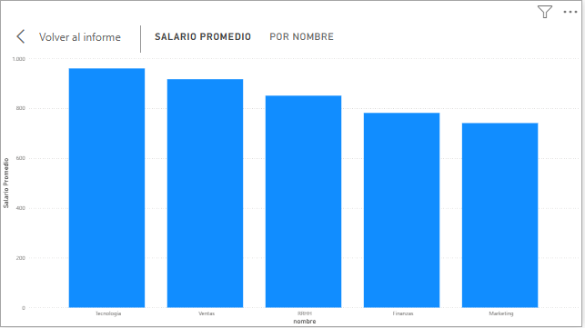
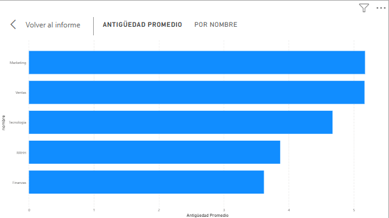
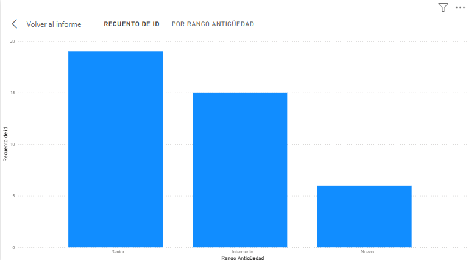

# Análisis de RRHH — Salarios, Antigüedad y Distribución por Departamento

## 📊 Qué resuelve
Este análisis responde tres preguntas clave de gestión de personal: 
¿cómo se distribuyen los salarios entre departamentos?, ¿qué tan 
antiguos son los equipos por área?, y ¿qué proporción de la plantilla 
es nueva, intermedia o senior? Estas métricas apoyan decisiones de 
retención, compensación y planificación de contrataciones.

## 🛠️ Stack
- SQL (SQLite) — extracción y agregación
- Power BI — modelado y visualización
- DAX — medidas calculadas

## 📈 Métricas incluidas
- Salario promedio por departamento
- Antigüedad promedio por departamento
- Distribución de empleados por rango de antigüedad (Nuevo / Intermedio / Senior)

## 🖼️ Capturas

## 🔁 Cómo reproducirlo
1. Ejecutar `tablas_rrhh.sql` para crear y poblar las tablas
2. Ejecutar `consultas_RRHH.sql` para correr las 3 métricas
3. Abrir `proyecto_RRHH.pbix` en Power BI Desktop
